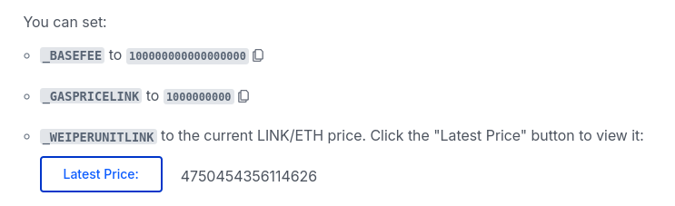

# Hardhat Smart Contract Lottery

Updated Patrick Code for Raffle.sol: https://github.com/Cyfrin/foundry-smart-contract-lottery-cu/blob/main/src/Raffle.sol

Updated Video for smartcontractlottery: https://youtu.be/-1GB6m39-rM?si=DHhy67y5eyBAJp3p&t=50510

smartcontractkit link: https://github.com/PatrickAlphaC/hardhat-smartcontract-lottery-fcc

Code link Patrick: https://github.com/smartcontractkit/full-blockchain-solidity-course-js?tab=readme-ov-file#lesson-9-hardhat-smart-contract-lottery

Subscriptions ChainLink VRF: https://vrf.chain.link/

### Important!

The moralis integration has been removed. Please use the the graph integration instead.
https://thegraph.com/

## Install Packages (Updated)

```
yarn add --dev @chainlink/contracts@1.2.0 @nomicfoundation/hardhat-chai-matchers@^2.0.0 @nomicfoundation/hardhat-ethers@npm:hardhat-deploy-ethers @nomicfoundation/hardhat-network-helpers@^1.0.0 @nomicfoundation/hardhat-verify@^2.0.0 @nomiclabs/hardhat-ethers@^2.2.3 @nomiclabs/hardhat-solhint@^4.0.1 @nomiclabs/hardhat-waffle@^2.0.6 @typechain/ethers-v6@^0.5.0 @typechain/hardhat@^9.0.0 @types/sinon-chai@^3.2.3 chai@^4.2.0 dotenv@^16.4.5 ethereum-waffle@^3.0.0 ethers@^5.0.0 hardhat@^2.22.10 hardhat-deploy@^0.12.4 hardhat-gas-reporter@^1.0.8 prettier@^3.3.3 prettier-plugin-solidity@^1.4.1 solidity-coverage@^0.8.0 typechain@^8.3.0 hardhat-contract-sizer
```

### hardhat-shorthand package

hardhat-shorthand is an NPM package that installs a globally accessible binary called hh that runs the project's locally installed hardhat and supports shell autocompletion for tasks.

Run:

```
yarn global add hardhat-shorthand
```

IMPORTANT: you need to install globally

Now instead

Check the guide to learn more: https://hardhat.org/hardhat-runner/docs/guides/command-line-completion

To enable autocomplete support you'll also need to install the shell completion script using hardhat-completion, which comes with hardhat-shorthand. Run hardhat-completion install and follow the instructions to install the completion script.

#### Linux Users Installations hh (hardhat-shorthand)

It could happen that `hh` shorthand command for Hardhat is not being recognized, even though you've installed `hardhat-shorthand` globally.

To resolve this issue:

Do this from the terminal opened in your project directory such as `mattia@mat:~/Code/codecamp/hardhat-smartcontract-lottery$`

1. **Check if `yarn` global bin path is in your `$PATH`**:

    - First, check where `yarn global add` installs binaries:
        ```bash
        yarn global bin
        ```
        This should output a directory path, like `/home/your_user/.yarn/bin` or `/usr/local/bin`.

2. **Add Yarn's global bin directory to `$PATH`** (if it's not already):

    - Open your terminal configuration file (`.bashrc`, `.zshrc`, etc.) and add the following line:
        ```bash
        export PATH="$PATH:$(yarn global bin)"
        ```
    - After saving, apply the changes with:
        ```bash
        source ~/.bashrc  # or ~/.zshrc
        ```

3. **Verify installation**:
    - Run the following to confirm that `hh` is now recognized:
        ```bash
        hh --version
        ```

### Chainlink contracts package

@chainlink/contracts@1.2.0

We will need to copy the 2 mock contracts VRFv2_5Consumer and VRFCoordinatorV2_5Mock

Create a `mock` folder inside the `contracts` folder and create 2 new files with the names of the contracts.

To obtain the mocks go to: https://docs.chain.link/vrf/v2-5/subscription/test-locally

## Data Structures

### Enums

Enums are a way to declare a new custom type in solidity.
In our Raffle contract we want to create an enum that keeps trck of the lottery state. In order
for the contract to know when the lottery is open, closed, etc...

```
enum RaffleState {
    OPEN,
    CALCULATING,
    CLOSED
}
// uint256 0 = OPEN, 1 = CALCULATING, 2 = CLOSED
```

In the background this corresponds to a uint256 that has differnt values assigned, based on each state

### Events

Link to Patrick explanation: https://youtu.be/gyMwXuJrbJQ?si=22TR72UVWVyB9WWY&t=50186
Link to docs.soliditylang: https://docs.soliditylang.org/en/stable/contracts.html#events

Certainly! Let's break this down and explain the purpose of events in Solidity, particularly in the context of dynamic arrays or mappings:

#### 1. **What are Events in Solidity?**

-   **Events** are a way for smart contracts to log data on the blockchain. They are used to notify external consumers (like off-chain applications or services) about something important that happened in the contract.
-   Events are stored in the **transaction log** (logs), a special part of the blockchain that can be accessed by external entities (like dApps, blockchain explorers, etc.) but **not directly by other smart contracts**.
-   They are commonly used to log state changes or signal certain actions (e.g., a new player joining a raffle, a winner being picked, etc.).

#### 2. **Why Use Events for Dynamic Arrays or Mappings?**

-   **Dynamic arrays** and **mappings** are mutable structures in Solidity, meaning their size or content can change during contract execution (e.g., adding or removing players from the `s_players` array).
-   When updating these structures, emitting an event allows external users (or front-end interfaces) to know that a change has occurred. For instance, when a player enters a raffle, you can emit an event to notify that a new player has joined.

Example of event emission when updating an array:

```solidity
event PlayerEntered(address indexed player);

function enterRaffle() public payable {
    // Some logic...
    s_players.push(payable(msg.sender));  // Update dynamic array
    emit PlayerEntered(msg.sender);  // Emit event
}
```

-   Here, the `PlayerEntered` event is emitted each time a new player joins the raffle, making it easy for off-chain systems to track this event without needing to read the contract state.

#### 3. **Why Are Events Cheaper?**

-   **Events are cheaper** to store compared to writing data directly to storage because:
    -   Events are stored in a separate part of the blockchain called **logs**, which are **outside the contract's storage**. Logs can be thought of as a more efficient and lightweight storage area.
    -   Smart contracts **cannot access logs** once they are emitted. This makes logs more efficient since Solidity doesn’t need to spend gas maintaining their accessibility to the contract.
    -   Writing to storage (like updating an array or mapping) is expensive in terms of gas because storage modifications require multiple operations on the blockchain, including saving the data and ensuring future access.
    -   Logs (or events) don't require as much gas because they are simpler to store and access externally, and they are **not part of the state variables of the contract**.

#### 4. **Logs Are Not Accessible by Contracts**

-   Once an event is emitted, the data goes into a structure called a **log**. Logs are accessible to **off-chain applications**, but **other smart contracts cannot read them**.
-   This is because logs are meant to be a way to broadcast information externally (to the blockchain's event listeners), not to be used by other contracts internally.

#### Summary:

-   **Events** are used to log data changes, like updates to dynamic arrays or mappings.
-   **Emitting events** is useful for external users to track state changes (like a new player entering a raffle).
-   **Events are cheaper** to store than writing data to contract storage because they live in a separate "logs" data structure that contracts can’t access.
-   This is why developers emit events when updating arrays or mappings — it's more efficient and allows external systems to track important changes.

### Event example

```
event storedNumber(
    uint256 indexed oldNumber,
    uint256 indexed newNumber,
    uint256 addedNumber,
    address sender
)
```

When we emit this event `storedNumber` is going to have 4 parameters.
The paramenters of the events can be of 2 types:

-   indexed
-   non-indexed

Each event can have a maximum of 3 `indexed` parameters

<b> !IMPORTANT </b>
Indexed parameters are also known as <b>topics</b>

Indexed parameters or topics are much easier to search and query than non-indexed paramenters

The non-indexed parameters are encoded in the ABI. That's why are more complex to read. You need tha ABI associated with the contract.

## Introduction to Chainlink VRF (Randomness in Web3)

Subscriptions ChainLink VRF: https://vrf.chain.link/

Chainlink VRF v2.5 docs: https://docs.chain.link/vrf
Video explanation 1: https://www.youtube.com/watch?v=eRzLNfn4LGc
Video Explanation 2: https://youtu.be/gyMwXuJrbJQ?si=UXGhxBgMG9t-KnBb&t=50588

Local test explained: https://docs.chain.link/vrf/v2-5/subscription/test-locally

### Testing logic

Complete the following tasks to test your VRF v2.5 consumer locally:

1. Deploy the VRFCoordinatorV2_5Mock. This contract is a mock of the VRFCoordinatorV2_5 contract.
2. Call the createSubscription function (which VRFCoordinatorV2_5Mock inherits) to create a new subscription.
3. Call the VRFCoordinatorV2_5Mock fundSubscription function to fund your newly created subscription. Note: You can fund with an arbitrary amount.
4. Deploy your VRF consumer contract.
5. Call the addConsumer function (which VRFCoordinatorV2_5Mock inherits) to add your consumer contract to your subscription.
6. Request random words from your consumer contract.
   Call the VRFCoordinatorV2_5Mock fulfillRandomWords function to fulfill your consumer contract request.

Try testing locally.

You can get the test here https://github.com/smartcontractkit/hardhat-starter-kit/blob/main/test/unit/RandomNumberConsumer.spec.js

## Introduction to Chainlink Automation

In order to automatically trigger some functions of our contracts we are going to use ChainLink Automation

> ℹ️ **GET STARTED**  
> Try Chainlink Automation in the [Getting Started](https://docs.chain.link/chainlink-automation/overview/getting-started) guide.

---

> ⚠️ **DEPRECATION OF OLDER UPKEEPS**  
> Existing upkeeps on versions earlier than v2.1 will stop being performed on **August 29, 2024**.  
> [Migrate your older upkeeps](https://docs.chain.link/chainlink-automation/guides/migrate-to-v2) to the latest version of Automation.

### Test and Depoly the Upkeep

ChainLink Keepers (deprecated) video explanation (still usefull): https://youtu.be/gyMwXuJrbJQ?si=IuAdQSnuL8huNSds&t=52167

Follow this Chainlink example: https://docs.chain.link/chainlink-automation/guides/compatible-contracts#example-automation-compatible-contract-using-custom-logic-trigger

Supported Networks: https://docs.chain.link/chainlink-automation/overview/supported-networks

We may need to use chainlink CCIP: https://docs.chain.link/ccip

### Deploy Mocks

In order to deploy VRFCoordinatorV2_5Mock we need to pass 3 arguments to the constructor:

-   `uint96 _baseFee`
-   `uint96 _gasPrice`
-   `int256 _weiPerUnitLink`

Check in the [documentation](https://docs.chain.link/vrf/v2-5/supported-networks) the parameters provided by Chainlink for the parameters det for example on Sepolia testnet.

To get more precise values go to [Deploy VRFCoordinatorV2_5Mock](https://docs.chain.link/vrf/v2-5/subscription/test-locally#deploy-vrfcoordinatorv2_5mock) where you can find some standard values
(These values are for paying the oracle with LINK! nont with ETH)



## Create and Fund ChainLink VRF Subscriptions Programatically

For local testing on "hardhat" network is in fact needed to create a subscription programmatically

## Raffle.test.js

Refer to [chai matchers docs](https://ethereum-waffle.readthedocs.io/en/latest/matchers.html#emitting-events) for testing

Example of matching an event:

```
await expect(token.transfer(walletTo.address, 7))
  .to.emit(token, 'Transfer')
  .withArgs(wallet.address, walletTo.address, 7);

```

### Testing Raffle doesn't allow new players to join when it is Not Open

performUpkeep() is the only function that can change the `raffleState` to `RaffleState.CALCULATING`
We will pretend to be the chainlink Upkeeper and keeper
checkUpkeep() needs to return `upkeepNeeded == true` in order for
chainlinak keeper to call `performUpkeep`.
We need to satisfy (true) the following conditions:

-   bool isOpen = RaffleState.OPEN == s_raffleState;
-   bool timePassed = ((block.timestamp - s_lastTimeStamp) > i_interval);
-   bool hasPlayers = (s_players.length > 0);
-   bool hasBalance = (address(this).balance > 0);

Refer to [hardhat network docs](https://hardhat.org/hardhat-network/docs/reference) when interacting with the chain

In particulare we are going to use [Hardhat network methods](https://hardhat.org/hardhat-network/docs/reference#hardhat-network-methods) and [special testing/debugging methods](https://hardhat.org/hardhat-network/docs/reference#special-testing/debugging-methods) to satisfy the condition:

-   bool timePassed = ((block.timestamp - s_lastTimeStamp) > i_interval);

```
it("Doesn't allow to enter raffle when raffle is NOT open", async function () {
    await raffle.enterRaffle({ value: raffleEntranceFee })
    await network.provider.send("evm_increaseTime", [interval.toNumber() + 1])
    await network.provider.send("evm_mine", [])
    await raffle.performUpkeep([])
})
```

### testing returns false if there are no players

`await raffle.checkUpKeep([])`
Instead of actually calling "raffle.checkUpKeep([])" we can simulate a transaction by using callstatic.

#### **callstatic**

`raffle.callStatic.checkUpkeep([])` will return:

-   bool upkeepNeeded
-   bytes memory /_ performData _/

We can extrapolate `upkeepNeeded` value like so:

```
const { upkeepNeeded } = await raffle.callStatic.checkUpkeep([])
```
